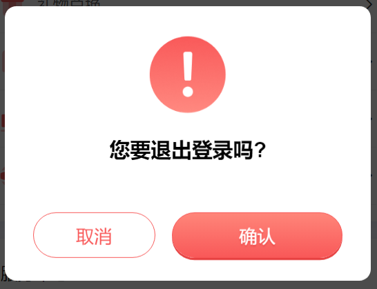
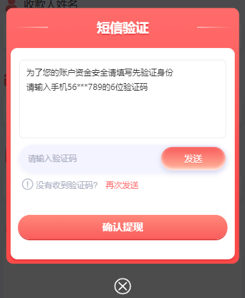

### 注意事项

-   [项目说明](#-1)
-   [问题记录](./docs/issues.md)
-   [1. svg 组件使用](#1)
-   ~~[2. (已废弃)接口写法及注意事项](#2)~~
-   [3. 公用方法](#3)
-   [4. 提交流程规范](#4)
-   [5. 使用 eslint 格式化代码](#5)
-   [6. 移动端适配](#6)
-   [7. css 公共部分](#7)
-   ~~[8. (已废弃)filter 添加与使用]~~
-   [9. 空数据组件](#9)
-   [10. BEM 使用示范案例](./docs/Infomation.md)
-   [11. 路由跳转](#11)
-   [12. i18n 国际化使用](#12)
-   [13. 图片懒加载指令](#13)
-   [14. 选项框公用组件](#14)
-   [15. pinia-store 监听-子组件 props 监听](#15)
-   [16. LoadingView 组件使用](#16)
-   [17. 渲染列表-加载更多 注意事项](#17)
-   [18. Dialog 公用组件](#18)
-   [19. 顶部选项框固定写法](#19)
-   [20. WinGo 投注弹框](#20)
-   [21. 跨组件通信](#21)
-   [22. 跨日期选择的日历](#22)
-   [23. List 分页组件使用说明](#23)
-   [24. 统一使用请求接口异常处理方法](#24)
-   [25. 接口类型处理方法](#25)
-   ~~[26. (已废弃)接口类型处理方法二]~~
-   [27. 注释添加格式](#27)
-   [28. 国际化日期格式使用](#28)

<h3 id="-1">项目说明</h3>

-   [git 提交流程](./docs/Infomation.md)
-   [1, sourcetree 操作步骤](./docs/Infomation.md)
-   [2, 文件结构](./docs/Infomation.md)
-   [3, typescript 方法]('https://www.yuque.com/yuqueyonghu3j83kk/fecg1a/qr541t?singleDoc# 《TypeScript》')
-   环境

```
node v16.19.0
npm 8.19.3
nvm 1.1.10

打包说明：
cd ~/ar_v2_vue
打开git Bash 或者 在vscode中控制台使用bash

首次运行脚本 需要在控制台中输入 chmod +x ./pack.sh, 然后运行 ./pack.sh
之后运行脚本 直接在bash 中输入 ./pack.sh

```

<h3 id="1">1. svg 组件使用</h3>

-   如果直接使用 svg 标签会很难做到缓存 svg 图标，所以采用了 js 引入法
-   使用方式如下：

```js
/**
 * @description 方式一，可以用vue3的built-in组件 <component /> 做到动态引入。或者把用defineAsyncComponent引入的svg直接当组件使用
 */

<script>

import { defineAsyncComponent } from  'vue'

const speakerIcon = defineAsyncComponent(() => import('@/svg/home/noticeBarSpeaker.vue'))

<script />

<template>

	<component :is="speakerIcon" />

// or

	<speakerIcon />

<template />

```

```js
/**
 * @description 方式二，直接引入svg文件当组件使用
 */

<script>

import IconOpen from '@/assets/open.svg'

<script />

<template>

	<IconOpen />

<template />
```

<h3 id="2">2. 接口写法及注意事项</h3>

> 书写方法

-   接口样例路径 `src/types/api`,`src/api/modules/home.ts`

> 使用方法

-   文件路径 `@/utils`
-   接口样例路径 `src/views/activity/index.vue`

    ```ts
    // 使用方法
    import { onMounted } from 'vue'
    import { showFailToast } from 'vant'
    import { AwaitWrap } from '@/utils'
    import { getLotterySoltList } from '@/api'
    import type { GameListProps } from '@/types/api'

    const getHotGameListData = async () => {
    	const [err, res] = await AwaitWrap<GameListProps>(
    		getLotterySoltList({
    			type: gameList[active.value].type,
    			pagesize: 12
    		})
    	)

    	if (err) {
    		showFailToast(err.msg)
    		console.log(err)
    	} else if (res) {
    		// slotList.value = res
    		slotList.value = mockData
    	}
    }

    const onChange = () => {
    	getHotGameListData()
    }

    onMounted(async () => {
    	getHotGameListData()
    })
    ```

-   注意事项

    ```ts
    -   接口对接的时候，要将字段注释好，写在返回类型的备注上
    -   格式

    /*
    	a: '订单号'
    	b: '订单时间'
    	c：'下单时间'
    	...
    */
    type ResXxx = {
    	a: string
    	b: string
    	c: string
    	...
    }
    /*
    	d: '订单开始时间'
    	e: '订单结束时间'
    	f：'订单状态'
    	...
    */
    type ReqXxx = {
    	d: string
    	e: string
    	f: string
    	...
    }
    ```

<h3 id="3">3. 公用方法</h3>

-   自定义组件说明
    > 路径 `src/directives`
    -   v-lazy
    -   v-debounce="[fn, 500]"
    -   v-throttle="[fn, 500]"
-   使用不带符号的 currency 方法时，需要在第二个参数中传入空格符号 `currency(userInfo.integral, ' ') `

```js
// 注意：平时展示的第一页不要用v-lazy.
// 图片引用
;

import { getIcons } from '@/utils'

//
```

<h3 id="4">4. 提交流程规范</h3>

-   提交 type 类型规范， 可以为以下这些值，带`*`为常用值

```
    *feat（新功能）
    *fix（修复相关）
    *perf（性能相关）
    build（打包问题说明）
    chore（测试用例问题说明）
    ci（持续集成中遇到的问题）
    docs（文档内容）
    refactor（重构）
    revert（回滚）
    style（样式说明）
    test（测试说明）
```

-   使用

```shell
git commit -m "fix: bug-husky"
git commit -m "feat: add-husky"
git commit -m "pert: add-新增外部排序算法，处理xxx排序问题"
```

<h3 id="5">5. 使用eslint格式化代码</h3>

`安装vscode插件 eslint`

-   [vscode 保存时自动 ESlint 格式化](https://www.cnblogs.com/fuhua/p/13425540.html)
-   [vscode eslint 自动格式化](https://www.jianshu.com/p/a8dba5febe5e)
-   [vue3 项目中使用 ESLint 和 Prettier](https://whyes.xyz/post/%E5%A6%82%E4%BD%95%E5%9C%A8%E9%A1%B9%E7%9B%AE%E4%B8%AD%E4%BD%BF%E7%94%A8eslint%E5%92%8Cprettier/#%E5%AE%89%E8%A3%85eslint%E5%92%8Cprettier)

<h3 id="6">6. 移动端适配</h3>

-   [vite 中使用 postcss-px-to-viewport 无法使用 vant 等多种设计尺寸问题|postcss-plugins](https://blog.csdn.net/weixin_42998707/article/details/124150578)
-   [VantUI 适配移动端 750px 设计稿](https://bbchin.com/archives/vantui-750)

<h3 id="7">7. css 公共部分</h3>

```
    1. 边框1px
        ar-1px-t,  上
        ar-1px-b,  下
        ar-1px-tb, 上下
        ar-1px-l,  左
        ar-1px-r   右
    2. 清除浮动      clearfix
    3. 超出显示...   text-dots 需要指定宽度
    4. 必填项        must
    5.后面遇到的继续补充

```

~~ <h3 id="8">8. filter 添加与使用(已废弃)</h3> ~~

-   filter 配置文件目前分为中文、英文、繁体版 文件夹位置 `src/utils/selectArr`
-   demo 位置： `src/views/wallet/TransAction`
-   使用方法为：

```

首先在 `src/utils/selectArr` 路径添加数组，key-value键值对
booleanOp: [
	{
		value: 0,
		key: '全部'
	},
	{
		value: 1,
		key: '是'
	},
	{
		value: 2,
		key: '否'
	}
],

然后即可在页面调用对应方法 'filter' + first2UpperCase('booleanOp') 方法 => filterBooleanOp

```

```js
// 方法一
// 视图内使用
<p>
	{/* {{ $selArr.dateArr }} */}
	{{ $u.filterBooleanOp(1) }}
</p>
// script内使用
import { getCurrentInstance } from 'vue'
const {proxy} = getCurrentInstance()
// proxy.$selArr.dateArr
proxy.$u.filterBooleanOp(1)

// 方法二
// html
// 0全部 1是 2否
import { filter } from '@/utils'

console.log(filter, 'filter')
console.log(filter.Timestamp, 'filter')
console.log(filter.refiter, 'refiter') // filter相关对象


<p style="margin-top: 100px; font-size: 1em;">{{ filter.refiter.filterBooleanOp(1) }}</p>

// 方法来源
let actions = []
for (let key in rootConfig) {
	let first = rootConfig[key][0]
	if (first.auto === false) {
		break
	}
	let filterName = 'filter' + first2UpperCase(key)
	actions.push([
		filterName,
		(value) => {
			return returnValue(rootConfig[key], value)
		}
	])
}

```

<h3 id="9">9. 空数据组件</h3>

-   使用方法为：

```js
import Empty from '@/components/Empty/index.vue'

/**
 * @description 使用默认text
 */

<Empty />

/**
 * @description 使用slot
 */

<Empty>
	<template #text>
		XXX
	</template>
</Empty>

```

<h3 id="11">11. 路由跳转</h3>

```py

# 路由跳转
src/components/Activity/PointMall/Treasure.vue

# views/activity 文件夹下

# 跳转到 views/home
router.push({ name: 'home' })

# 跳转到 views/home/AllGames
router.push({ name: 'AllGames' })

# 跳转到 views/activity/PointMall/index.vue
router.push({ name: 'PointMall' })

# 跳转到 views/activity/PointMall/LotteryDetail/index.vue
router.push({ name: 'PointMall-LotteryDetail' })

```

<h3 id="12">12. i18n国际化使用</h3>

-   [i18n 国际化使用](https://note.qscoding.com/guide/vue3-i18n.html)
-   和 `vue2` 一样用

```js
/**
 * 模板里使用
 */
$t('xxx.xxx')

/**
 * script标签内使用
 */
import { useI18n } from 'vue-i18n'

const { t } = useI18n()

t('xxx.xxx')
/**
 * Unicode字符集匹配中文字符
 */
// [\u4e00-\u9fa5]+
zh // 中
en // 英
rus // 俄
vi // 越南
id // 印度尼西亚
hd // 印地
tha // 泰
md // 缅甸
bra // 葡萄牙
my // 马来西亚
ph // 菲律宾
```

<h3 id="13">13. 图片懒加载指令</h3>

-   注意事项：平时展示的第一页不要用 v-lazy
-   使用方法为：

```html
<!-- 当 item['userPhoto']无效 且 不用默认图片的时候  则用 data-img 属性-->

```

<h3 id="14">14. 选项框公用组件</h3>

-   文件地址 `src/views/wallet/TransAction/index.vue`

```html
<div class="ar-searchbar">
	<div class="ar-searchbar__selector">
		<div @click="showPicker = true">
			<span class="ar-searchbar__selector-default"> {{ typeValue }} </span>
			<van-icon name="arrow-down" />
		</div>
	</div>

	<div class="ar-searchbar__selector">
		<div @click="showDataPick = true">
			<span class="ar-searchbar__selector-default"> {{ dateValue }} </span>
			<van-icon name="arrow-down" />
		</div>
	</div>
</div>

<!-- 配合弹窗层使用 -->
<!-- 交易类型 -->
<!-- <van-field v-model="typeValue" is-link readonly label="交易类型" placeholder="类型" @click="showPicker = true" /> -->

<van-popup v-model:show="showPicker" round position="bottom">
	<van-picker
		:columns-field-names="{ text: 'key', value: 'value', children: 'children' }"
		:columns="rootConfig.transMoneyTypes"
		@cancel="showPicker = false"
		@confirm="onConfirm"
	/>
</van-popup>

<!-- 日期选择 -->
<!-- <van-field v-model="dateValue" is-link readonly label="日期" placeholder="选择日期" @click="showDataPick = true" /> -->

<van-popup v-model:show="showDataPick" round position="bottom">
	<!-- <van-picker :columns="columns" @cancel="showDataPick = false" @confirm="onConfirm" /> -->
	<van-date-picker
		v-model="currentDate"
		:title="$t('pickDate')"
		@cancel="cancelDataPick"
		@confirm="onConfirmDataPick"
		:filter="filterDate"
		@change="changeDataPick"
		:min-date="minDate"
		:max-date="maxDate"
	/>
</van-popup>
```

```js
import { ref, onMounted, computed, reactive } from 'vue'
import { rootConfig } from '@/utils/selectArr/rootConfig'
import { formatTime, getIcons, copy, AwaitWrap, getDateStr, fixDateStr, formatTimeDay, dateRange } from '@/utils'
// 配合弹窗层使用
// 交易类型
const typeValue = ref(rootConfig.transMoneyTypes[0].key)
const showPicker = ref(false)

const onConfirm = ({ selectedOptions }: any) => {
	showPicker.value = false
	typeValue.value = selectedOptions[0].key
}

// 日期选择
const { key: dateLabel, value: dateVal } = fixDateStr()
const dateValue = ref(dateLabel)
const currentDate = ref(dateVal)
const { minDate, maxDate } = dateRange()
const showDataPick = ref(false)

const cancelDataPick = ({ selectedOptions }: any) => {
	console.log('cancelDataPick')
	showDataPick.value = false
}

const onConfirmDataPick = ({ selectedOptions }: any) => {
	console.log('onConfirmDataPick')
	showDataPick.value = false
	const [{ value: year }, { value: month }, { value: day }] = selectedOptions
	dateValue.value = formatTimeDay(year, month, day)
	console.log('selectedOptions: ', selectedOptions)
}
const changeDataPick = ({ selectedOptions }: any) => {
	console.log('changeDataPick')
}

let strDate = fixDateStr({ status: 2 })
console.log('strDate', strDate)
console.log('strDate', fixDateStr())
console.log('strDate', fixDateStr({ status: -1 }))

// 日期范围控制
const filterDate = (type: any, options: any) => {
	console.log('日期范围控制')
	console.log('type: ', type)
	console.log('options: ', options)
	return options
}
```

<h3 id="15">15. pinia-store监听-子组件props监听</h3>

```js
// pinia-store 监听
import { useCommonStore } from '@/stores'
// isLoading监听
const isLoad = ref(false)
const commonStore = useCommonStore()
const subscribe = commonStore.$subscribe((mutation, state) => {
	isLoad.value = state.isLoading
	commonStore.setLoading(isLoad.value)
})

// 子组件props监听
import { watch } from 'vue'

const props = defineProps({
	siteMsg: {
		type: Object,
		default: () => {}
	}
})

watch(
	props.siteMsg,
	(newVal, oldVal) => {
		console.log('siteMsg', newVal, oldVal)
		// showSiteMsg()
	},
	{ immediate: true }
)
```

<h3 id="16">16. LoadingView组件使用</h3>

-   路径 `src/components/common/LoadingView.vue`
-   参考路径 `src/views/home/index.vue`
-   使用

```ts
import { useCommonStore } from '@/stores'
const { setLoading } = useCommonStore()

setLoading(true)
// ajax ...
setLoading(false)
```

<h3 id="17">17. 渲染列表-加载更多 注意事项</h3>

-   第一次进入页面不能展示 `Empty` 组件
-   请求前、返回后 Loading 组件显示与隐藏
-   参考路径 `src/views/home/Messages/index.vue`

```html
<div class="sysMessage__container content">
	<NavBar title="通知" left-arrow @click-left="onClickLeft"></NavBar>

	<infinite-scroll
		class="sysMessage__container-msgWrapper"
		:distance="100"
		:on-arrived-bottom="loadMore"
		:loading="loading"
		:finished="finished"
		:page="pageNum"
		v-if="messageData.list.length > 0"
	>
		<template #content>
			<div class="sysMessage__container-msgWrapper__item" v-for="item in messageData.list" :key="item.messageId">
				<div class="sysMessage__container-msgWrapper__item-title">
					<component :is="item.state === 0 ? icons.messageIconRed : icons.messageIconIsRead" />
					<span>{{ item.title }}</span>
					<component
						:is="icons.messageGarbage"
						@click="($event: Event) => { $event.stopPropagation(); onDeleteClick(item) }"
					/>
				</div>
				<div class="sysMessage__container-msgWrapper__item-time">{{ item.addTime }}</div>
				<div class="sysMessage__container-msgWrapper__item-content">{{ item.messages }}</div>
			</div>
		</template>
	</infinite-scroll>
	<div class="sysMessage__container-empty" v-else-if="messageData.list.length == 0 && !isFirst">
		<Empty />
	</div>
</div>
```

```ts
import { useHomeStore, useCommonStore } from '@/stores'
const { setLoading } = useCommonStore()

onMounted(async () => {
	setLoading(true)
	const [errRead, resRead] = await AwaitWrap(readAll())

	const [err, res] = await getMessagesData()
	if (err) {
		setLoading(false)
		showFailToast({
			message: err.msg,
			wordBreak: 'break-word'
		})
	} else {
		messageData.value = res
		isFirst.value = false
		setLoading(false)
	}
})
```

<h3 id="18">18. Dialog公用组件</h3>

-   路径 `src/components/common/Dialog.vue`
-   参考路径 `src/views/home/index.vue`
-   样式

    > &nbsp; 

-   使用

```html
<!-- 
	const props = defineProps({
		show: { // 是否展示
			type: Boolean,
			default: false
		},
		title: { // 标题
			type: String,
			default: ''
		},
		confirmText: { // 确认按钮文本
			type: String,
			default: '确认'
		},
		showCancelBtn: { // 是否显示取消按钮 默认显示
			type: Boolean,
			default: true
		},
		cancelText: { // 取消按钮文本
			type: String,
			default: '取消'
		},
		clickOutSide: { // 点击弹窗阴影是否关闭弹窗 默认不关闭
			type: Boolean,
			default: false
		}
})
 -->

<dialog
	v-model:show="orderCancelResultDialogShow"
	@confirm="orderCancelResultDialogShow = false"
	:show-cancel-btn="false"
	confirmText="确认删除"
	cancelText="取消"
	title="订单已确认，无法取消"
>
	<template #header>
		
	</template>
</dialog>
```

<h3 id="19">19. DiaLogOther公用组件</h3>

-   路径 `src/components/common/DiaLogOther.vue`
-   参考路径 `src/views/wallet/Withdraw/AddBankCard/index.vue`
-   样式

    > &nbsp; 

-   使用

 <!--备注:
​	 1、header：一般不动，设置title即可
​    2、footer：一般不动，默认内容是一个关闭按钮
​    3、content：A、内容自定义，格式如下:
​                <template #content>
​				    <div class="info-dialog-content-xxx">
​					    xxxxxxxxx
​				    </div>
​			    </template>	
​    
                B、这部分需要自己写样式，格式如下:
                .info-dialog {
                    &-content {
    	                &-xxx {
                        }
                    }
                }  
 -->

```html
<!-- 
	const props = defineProps({
    show: {//是否展示弹窗
        type: Boolean,
        default: false
    },
    title: {//标题
        type: String,
        default: ''
    },
    confirmText: { //确认按钮文本
        type: String,
        default: '确认'
    },
    showCancelBtn: {//是否显示取消按钮,默认不显示
        type: Boolean,
        default: false
    },
    cancelText: {//取消按钮文本     
        type: String,
        default: '取消'
    }
})
 -->

<DiaLogOther v-model:show="SMSVerificationDialogShow" @confirm="onconfirm" title="短信验证" confirmText="确认提现">
	<template #content>
		<div class="info-dialog-content-xxx">xxxxxxxxx</div>
	</template>
</DiaLogOther>
```

<h3 id="19">19. 顶部选项框固定写法</h3>

```html
<div class="myCommission__container" ref="containerRef">
	<van-sticky :offset-top="$u.TopHeight" :container="containerRef">
		<div class="ar-searchbar">
			<div class="ar-searchbar__selector" :class="{ active: dropdownShow }">
				<div @click="showDataPick = true">
					<span class="ar-searchbar__selector-default"> {{ dateValue }} </span>
					<van-icon name="arrow-down" />
				</div>
			</div>
		</div>
	</van-sticky>
</div>

<!-- js -->
const containerRef = ref<HTMLElement>(null as any) </HTMLElement>
```

<h3 id="20">20. WinGo投注弹框</h3>

-   路径 `src\components\common\BettingPopup.vue`
-   参考路径 `src\components\Home\AllLotteryGames\WinGo\Betting.vue`
-   使用

```html
<BettingPopup
	:currentGame="currentGame"
	:selectInfo="selectInfo"
	:bettingPopupShow="bettingPopupShow"
	:betTypeList="betTypeList"
	:multipleList="multipleList"
	@clearBetting="clearBetting"
	@submitBetting="submitBettingData"
/>
```

```ts
import BettingPopup from '@/components/common/BettingPopup.vue'

const props = defineProps({
	currentGame: {
		// 选中的游戏
		type: Object,
		default: () => ({})
	},
	selectInfo: {
		// 投注相关参数
		type: Object,
		default: () => ({})
	},
	bettingPopupShow: {
		// 是否展示弹窗
		type: Boolean,
		default: ref(false)
	},
	betTypeList: {
		// 金额列表
		type: Array,
		default: []
	},
	multipleList: {
		// 份数快捷选项按钮
		type: Array,
		default: () => [1, 5, 10, 20, 50, 100]
	}
})
```

<h3 id="21">21. 跨组件通信</h3>

```ts
import { useEventBus } from '@/components/common/use'
const eventBus = useEventBus()
// 发送
eventBus.emit('test-add', 'el')
// 接受
eventBus.on('test-add', (el) => {
	//   fn(el)
})
// 取消 一般用在组件销毁阶段处理
// 在 eventBus.on 一个页面处理 不让其重复接收
onBeforeUnmount(() => {
	eventBus.off('test-add')
})
```

<h3 id="20">20. WinGo投注弹框</h3>

-   路径 `src\components\common\BettingPopup.vue`
-   参考路径 `src\components\Home\AllLotteryGames\WinGo\Betting.vue`
-   使用

```html
<BettingPopup
	:currentGame="currentGame"
	:selectInfo="selectInfo"
	:bettingPopupShow="bettingPopupShow"
	:betTypeList="betTypeList"
	:multipleList="multipleList"
	@clearBetting="clearBetting"
	@submitBetting="submitBettingData"
/>
```

```ts
import BettingPopup from '@/components/common/BettingPopup.vue'

const props = defineProps({
	currentGame: {
		// 选中的游戏
		type: Object,
		default: () => ({})
	},
	selectInfo: {
		// 投注相关参数
		type: Object,
		default: () => ({})
	},
	bettingPopupShow: {
		// 是否展示弹窗
		type: Boolean,
		default: ref(false)
	},
	betTypeList: {
		// 金额列表
		type: Array,
		default: []
	},
	multipleList: {
		// 份数快捷选项按钮
		type: Array,
		default: () => [1, 5, 10, 20, 50, 100]
	}
})
```

<h3 id="22">22. 跨日期选择的日历</h3>
```html
<Calendar ref="calendar" @confirm="xxxxxx" />
```

```ts
import Calendar from '@/components/common/Calendar.vue'
const calendar = ref()
const startDateValue = calendar.value.startDateValue //开始日期
const endDateValue = calendar.value.endDateValue //结束日期
function xxxxxx() {}
```

<h3 id="23">23. List 分页组件使用说明</h3>

```html
<List
	v-model:list="inviList"
	v-model:page-query="pageQuery"
	:api="getPromotionMytem"
	:distance="100"
	ref="listRef"
	v-model:is-first="isFirst"
	@pageChange="getChange"
	:filter="handleFilter"
>
	<template #content> </template>
</List>
```

```ts
import List from '@/components/common/List.vue'
const inviList = ref([]) // 分页数组列表
const isFirst = ref(true) // 是否首次加载
const listRef = ref() // 获取组件实例ref
const pageQuery = reactive<ReqPromotionMytem>({
	// 除分页信息外其它参数
	startDate: '2023-01-10T17:07:52.608Z',
	endDate: '2023-03-17T17:07:52.608Z',
	lv: 2,
	myTemId: 0
})
listRef.value.resetRefresh() // 重置列表组件，并请求接口
// 列表变动时获取信息
const getChange = (obj: PromotionMytemData) => {
	console.log(obj)
}
// 数组数据过滤方法
const handleFilter = (list: chargeRecordList[]): chargeRecordList[] => {
	let newList = deepCopy(list)
	newList.reverse()
	return newList
}
```

<h3 id="24">24. 统一使用请求接口异常处理方法</h3>

```ts
import { login } from '@/api'

import { AwaitApiResult } from '@/utils'
const res = await AwaitApiResult(login(data))
if (res) {
	// do something
}
```

<h3 id="25">25. 接口类型处理方法</h3>

-   路径 `src/types/global.d.ts`
-   参考路径 `src/views/login/index.vue`--`src/api/modules/user.ts`
-   带分页类型路 `src/views/home/Messages/index.vue`

```ts
// 未带分页类型
// 接口方法部分
//验证是否开放注册和短信注册

import type { ResRegisterState, ReqMessageState, ResMessageList } from '@/types/api'
import { RegisterState } from '@/api'

export const RegisterState = (): Promise<CommonObjRes<ResRegisterState>> => {
	return post(api.RegisterState)
}

// 接口调用部分
async function registerState() {
	const res: ObjResNull<ResRegisterState> = await AwaitApiResult(RegisterState())
	if (res) {
		registerData.value.isRegisterState = res.data.registerState //是否开放注册1：开放注册
		registerData.value.registerStateMsg = res.data.registerStateMsg //是否开放注册内容
		if (res.data.registerState !== '1') {
			showFailToast({
				message: res.data.registerStateMsg,
				wordBreak: 'break-word'
			})
		} else {
			registerData.value.registerSMSState = res.data.registerSMSState //是否开放短信注册
		}
	}
}

// 带分页类型
export const setMessageState = (params: ReqMessageState): Promise<CommonRes<ResMessageList>> => {
	return post(api.SetOneMessageState, params)
}

const messageData = ref<MessageData<ResMessageList>>({
	list: [],
	pageNo: 0,
	totalPage: 0,
	totalCount: 0
})
const res: ObjResNull<ListRes<ResMessageList>> = await AwaitApiResult(
	setMessageState({
		uid: userInfo.userId,
		sign: userInfo.sign,
		messageId: item.messageID,
		state: 2
	})
)

if (res) {
	let messagelist = messageData.value.list
	messagelist = messagelist.filter((i) => i.messageID !== item.messageID)
}
```

<h3 id="26">(已废弃！！!)接口类型处理方法二</h3>
 
-   路径 axios返回值中添加data `src/api/axios.ts` `src/api/modules/home.ts`
-   参考路径 `src/views/home/Messages/index.vue` , `src/components/common/Lists.vue`
-   使用

```ts
const posts = (
	url: string,
	data?: object | string,
	option?: {
		isUploadFile?: boolean
		noLoading?: boolean
	}
) => {
	const urls = import.meta.env.MODE === 'production' ? localStorage.getItem('ApiUrl') || baseURL : baseURL
	// const urls = localStorage.getItem('ApiUrl') || ''
	// console.log('urls: ', urls + url)
	return service({
		url: urls + extendURL + url,
		method: 'post',
		headers: {
			'Content-Type': ContentTypeEnum.JSON,
			noLoading: option?.noLoading || false
			// Accept: 'application/json, text/plain, */*',
			// 'Content-Type': 'application/json;charset=utf-8;',
			// platform: 'PC',
			// sid: TOKEN && TOKEN.sessionId,
			// lang: lang,
		},
		// data: isUploadFile ? data : JSON.stringify(data),
		data: data ? data : {}
	}).then((response) => {
		return { data: response } <!--在这个地方主动添加一个data，以用于后端异常捕获-->
	})
}

```

```ts
// 后端接口 posts 方法  并不是post方法
export const getMessages = (params: ReqMessageList) => {
	return posts(api.GetMessageList, params).then((res) => res.data)
}

async function getMessagesData() {
	const [err, res] = await AwaitWrap(
		getMessages({
			pageNo: messageDataQuery.pageNo,
			pageSize: messageDataQuery.pageSize
		})
	)

	return [err, res]
}

onMounted(async () => {
	setLoading(true)
	const [err, res] = await getMessagesData()
	let result = getExcep(err, res)
	if (result) {
		messageData.value = res.data.data
		isFirst.value = false
	}
	setLoading(false)
})
```

<h3 id="27">27. 注释添加格式</h3>

```ts

// 接口方法注释添加-不带分页-不带参数

/**
 * @description: 获取用户地址
 */
export const GetUserAddress = async (): Promise<CommonObjRes<UserAddress>> => {
	return post(api.GetUserAddress)
}


// 接口方法注释添加-带分页-带请求参数

/**
 * @description: 我的5D比赛记录（带分页）
 * @param {FD} params
 * @return {*}
 */
export const getMy5DEmerdList = (params: FD.reqGetNoaverage5DEmerdList): Promise<CommonRes<FD.resGetMy5DEmerdList>> => {
	return post(api.GetMy5DEmerdList, params)
}
const res = await AwaitApiResult<ObjResNull<MessageData<FD.resGetMy5DEmerdList>>>(
	getMy5DEmerdList({
		pageSize: 20,
		pageNo: pageNo.value,
		typeId: typeId.value
	})
)


// 结构体注释添加

/**
 * 每日签到请求类型
 * @uid 用户id
 * @sign 签名
 */
export type ReqDailySignIn = {
	uid: number
	sign: string
}


// 页面内注释添加

<div class="userinfo-content">
	<!-- 总余额及钱包 -->
	<TotalSavings :userInfo="userInfo" />
	<!-- 保险箱 积分商城 下注-交易-充值-提现 -->
	<FinancialServices :userInfo="userInfo" />
	<!-- 通知 邀请奖励 礼物兑换 商品订单 游戏统计 语言变更 -->
	<SettingPanel />
	<!-- 服务中心 -->
	<ServiceCenter />
</div>

// 页面内逻辑添加

// 动态组件ref
const RecordComponent = ref()
// 中奖组件
const WinningTipsRef = ref()
// 錢包組件
const WallteRef = ref()
// 上期信息组件
const tiemLeftRef = ref()
// 投注组件是否展示投注界面
const BettingPS = ref(false)
// 动态组件展示
const gameComponent = ref('GameRecord')
// 路由
const router = useRouter()

```

```js 时间显示修复
pageQuery.date = dayjs(currentDate.value).startOf('day').format('YYYY-MM-DD HH:mm:ss') //参数
const [{ value: year }, { value: month }, { value: day }] = selectedOptions // 显示
pageQuery.date = formatTimeDay(year, month, day)
```

<h3 id="28">28. 国际化日期格式使用</h3>

```ts
// 配置项
const i18n = createI18n({
  ...,
  datetimeFormats: {
    en: {
      short: {
        year: 'numeric',
        month: 'short',
        day: 'numeric',
      },
      long: {
        year: 'numeric',
        month: 'short',
        day: 'numeric',
        weekday: 'long',
      },
    },
    zh: {
      short: {
        year: 'numeric',
        month: 'numeric',
        day: 'numeric',
      },
      long: {
        year: 'numeric',
        month: 'long',
        day: 'numeric',
        weekday: 'long',
      },
    },
    // add more date formats for each locale here
  },
})
```

```ts
import { useI18n } from 'vue-i18n'

export default {
  name: 'MyComponent',
  setup() {
    const { t, d } = useI18n()

    const formattedDate = d(new Date(), 'short')

    return {
      formattedDate,
      greeting: t('hello'),
    }
  },
}

<p>{{ $t('hello') }}</p>
<p>{{ $d(new Date(), 'short') }}</p>

const date = new Date('2022-01-01')
const shortDate = this.$d(date, 'short') // returns '22年1月1日'
const longDate = this.$d(date, 'long') // returns '2022年1月1日星期六'
```
# point
